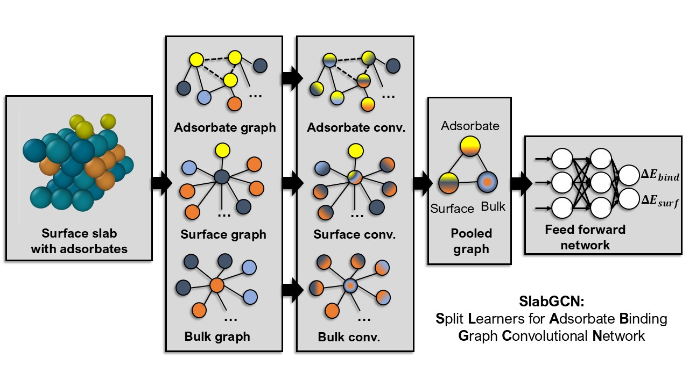

# Split Learners for Adsorbate Binding - Graph Convolutional Network (SlabGCN)

SlabGCN is a graph convolutional network that decomposes input atomistic structures into
multiple sub-graphs that are operated on by different convolution layers and subsequently
pooled into a coarse-grained graph using a graph attention network to predict one or 
more properties. 

This repository contains the most recent, actively-maintained version of SlabGCN. If you want
to train bespoke SlabGCN models for your own datasets, we recommend installing SlabGCN from
this repository. To get started, please follow the instructions below.

## Installation
1. First, create a conda environment:
```bash
conda create -n slabgcn python=3.11
```

2. Activate the environment:
```bash
conda activate slabgcn
```

3. Clone this repository and navigate to the directory.
```bash
git clone https://github.com/gauravsdeshmukh/SlabGCN.git
cd SlabGCN
```

4. Setup the repository using `install.py`. You need to specify either `cpu` or `gpu` in
place of `MODE`. You can also additionally specify a CUDA version in 
place of `CUDA_VERSION` (default version is 12.6). The validity of the specified version
is checked using Python's `requests` module, and hence requires an internet connection.
If you want to skip the CUDA version validity check, you can additionally provide a
`--skip-cuda-check` argument.
```bash
python install.py --mode MODE
```
OR
```bash
python install.py --mode MODE --cuda-version CUDA_VERSION --skip-cuda-check
```

For example, to install the GPU version of the model using CUDA version 12.1, enter the following:

```bash
python install.py --mode gpu --cuda-version 12.1
```

Successful completion of installation and testing will result in the "Setup completed successfully."
being displayed.

## Training Models and Making Predictions

To train a SlabGCN model on your dataset from scratch, follow the steps below:

1. Go to a fresh working directory outside the repository, let's say it is called `model_training`.

2. Create a subdirectory `structures` (it does not matter what it is called) inside `model_training`. 
Store structures in the form of .cif files in the subdirectory.

2. Create a CSV file in `structures` called `name_prop.csv` (it does not matter what it is called)
that contains multiple columns (without headers). The first column should contain the names of
all the .cif files. The remaining column(s) should contain values of corresponding properties
of all the structures. You can train on any number of output properties. A template CSV file
is provided under data/structs called `name_prop.csv`.

3. Go to your parent working directory (that is, `model_training`) and copy config by entering the following command:
```bash
copy-config
```

4. Open the configuration file and make appropriate changes. A full description of all the keys
and their corresponding values is provided in the next section. Ensure that `use_GPU` is set to
`false` if the repo is installed on CPU; if it is installed on GPU, `use_GPU` can either be `true`
or `false` based on whether you want to utilize the GPU for model training and prediction.

5. Train the model by using the `slabgcn` command-line utility. It can be used either
in `--train` mode or `--predict` mode. The former requires the mandatory specification of 
DATASET_PATH (path to directory containing .cif files) and CSV_PATH (path to csv file
containing names of .cif files and corresponding properties). Additionally,
the following optional arguments may be specified: CONFIG (path to config file),
 `--no-test` to prevent making predictions
on the held-out test set and making parity plots, SEED (integer seed; default is 0), EPOCHS 
(number of epochs; default is 500), and SAVE (name of directory to store model in; default is slabgcn_model).
Therefore, the generalized command to train the model is as follows:
```bash
slabgcn --train --dataset DATASET_PATH --csv CSV_PATH
```

OR (including optional arguments)

```bash
slabgcn --train --dataset DATASET_PATH --csv CSV_PATH --config CONFIG --no-test --seed SEED --epochs EPOCHS --save SAVE
```

As an example, following steps 1-4, your command, when run from the `model_training` directory, may look like the following:
```bash
slabgcn --train --dataset structures --csv structures/name_prop.csv --config config.csv --epochs 100 --seed 1 --save model_0
```

6. Let's say that you want to use the trained `model_0` to make a prediction for a new structure called `new_struct.cif`. This
can be accomplished using the `--predict` option of `slabgcn`, which requires the following mandatory arguments: STRUCTS (one or more paths, separated by spaces, to .cif files for which
predictions are to be made) and MODEL (trained model). An additional optional argument can be specified
to indicate the name of the directory RESULTS in which the results are to be stored (default is slabgcn_results).
Therefore, the generalized command to make predictions is as follows:
```bash
slabgcn --predict --structs STRUCTS --model MODEL
```

OR (including optional arguments)

```bash
slabgcn --predict --structs STRUCTS --model MODEL --results RESULTS
```

For the example given in step 6, the command may look like the following:
```bash
slabgcn --predict --structs new_struct.cif --model model_0
```

## Understanding the Config File
An explanation for all the keys in all the configs is provided below:

- `layer_cutoffs`: List of numbers that specify where to cut slabs to create subgraphs. If the numbers are integers, they are intepreted to be layer numbers from the bottom. If the numbers are floats, they are interpreted to be z-coordinates in Angstroms. For example, [2, 4] would mean that slabs would be cut into three partitions above layers 2 and 4 respectively. Further, if an empty list [] is provided, a simple GNN will (with a single partition) will be trained.
- `node_features`: List of features to be employed to featurize nodes in a given partition. Note that this should be a list of lists with the same length as the number of partitions. For each partition, any or all of the following node features may be specified: "atomic_number", "coordination", "electron_affinity", "valence", "dband_center".
- `edge_features`: List of features to be employed to featurize edges in a given partition. Note that this should be a list of lists with the same length as the number of partitions. For each partition, any or all of the following node features may be specified: "bulk_bond_distance", "surface_bond_distance", "adsorbate_bond_distance", "adsorbate_interaction" (the last one is only recommended for paritions with adsorbates).
- `ratios`: Contains three keys, "train", "val", and "test" specifying fractions of the overall dataset that should be allocated towards the training, validation, and test sets. The three numbers should add up to 1.
- `use_GPU`: Specify `true` if model is to be trained on a GPU with CUDA enabled; `false` otherwise for training on CPU.
- `batch_size`: Number of datapoints in a batch (must be an integer).
- `n_hidden`: Number of hidden layers in the final feed-forward neural network that predicts output properties. Must be an integer.
- `hidden_size`: Number of nodes in the hidden layers of the final feed-forward neural network. Must be an integer.
- `dropout`: Fraction of nodes to be dropped out during training for regularization. Must be between 0 and 1.0.
- `n_outputs`: Number of output properties. Must be an integer and must correspond to the number of outputs provided in the csv file specified under `csv_path`.
- `conv_type`: List with length same as the number of partitions. Specify the type of convolution function to be used for each partition. Can be any of the following: "CGConv", "NNConv", "GATConv", "ResGatedGraphConv" (case does not matter).
- `n_conv`: List with length same as the number of paritions. Specify the number of convolutional layers for each partition.
- `conv_size`: List with length same as the number of paritions. Specify the number of nodes in each convolutional layer for each partition.

## Contact and Citation
If you have any queries about the code, please contact the lead developer Gaurav Deshmukh over email (gauravsdeshmukh at outlook dot com). If this code has helped you in your research, please consider citing the [SlabGCN manuscript](https://pubs.acs.org/doi/10.1021/acs.chemmater.5c02484).
